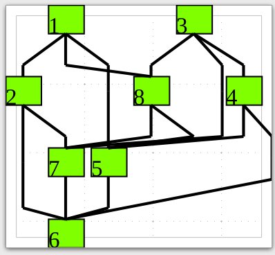

# sfgraph

a Single File Graph layout library in c and Java <https://graphviewer.nl>

See sfgdemo.c or sfg.h and the README1 file for details

The directory wasm is about compiling sfg.c to wasm and run sugiyama graph layout in the browser see [this test version](https://graphviewer.nl/misc/projects/sfg/test02/index.html)

To make the demo program sfgdemo type make

To cleanup use make clean

To indent the source use make indent

To check for memory leaks use make valgrind

To make libsfg.a use make sfga

To make libsfg.so use make sfgaso

To make python module with swig use make swigpython

To make perl module with swig use make swigperl

To make c++ with swig use make swigcplus

To make go with swig use make swiggo

To make java with swig use make swigjava

Also javascript, php, modula3 and more interfacing
to sfg.c can be generated with swig software

Using llvm compiler run scan-build-8 make

It compiles to javascript using emscripten emcc compiler

The python script sfgdemo.py runs graph layout using sfg.c

In the java directory is the Java source and a jar file

To run the Java version of sfg use: java -jar sfg.jar

Because sfg.c only needs calloc()/free() it is usable for embedded software

