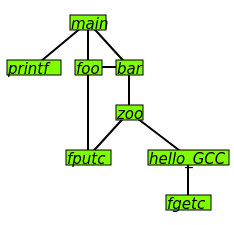

# gcc-11.1-callgraph-info

This is to generate callgraph images during compilation.  

gcc -fcallgraph-info generates a callgraph ci file which is a vcg graph usable with gml4gtk graph viewer.  

The graph routines are integrated in the gcc source to generate directly images and no graphviz or other extra program is needed  

With this the GNU GCC compiler is the first compiler generating graph images directly on the fly during compilation.  

The howto:  
Do not change the system gcc but create own customized gcc in own $HOME directory.  
Get the gcc-11.1 release version sources from gnu.org or it mirrors at gcc.gnu.org  
Optional get the newest needed gmp, mpfr and mpc libs and compile and install first system wide.  
Create a subdir for the gcc sources and unzip.  
In that directory copy the files in the gcc subdir into the gcc sources in that gcc dir.  
That will overwrite toplev.c but the original is kept in toplev.c.orig and sfg.c and sfg.h are added.  
Now configure gcc to be installed in a new directory in your own $HOME dir "mygcc" like this:  
./configure --prefix=$HOME/mygcc --enable-languages=c --disable-multilib --disable-nls  
or to have everything fom gcc:  
./configure --prefix=$HOME/mygcc  
Now run make and wait a few hours to complete  
Then run make install as user to install in your own $HOME/mygcc and that does not need root permissions  
To compile with the new created gcc compiler use:  
$HOME/mygcc/bin/gcc program.c  
To get callgraph images use -fcallgraph-info option and it will generate svg images and write graphviz gv files too.  
To compile a package:  
./configure CC=$HOME/mygcc/bin/gcc CFLAGS="-fcallgraph-info "  
or
./configure CC=$HOME/mygcc/bin/gcc CFLAGS="-fcallgraph-info=su,da "
The generated svg images can be used with inkscape, gimp, firefox or other image viewer  

Todo:  
This is a first test to check how usable this is and it *is* usable  
The indirect calls are not in the output but are in the ci output, to be fixed  
The extra possible info is in the ci output but can be added  
The drawing routines are minimal svg routines and to improve that will make the image more usable  
Some part of the graph layout routines need update to get better output drawings  
This waits on update of gml4gtk which waits on update of another program  
First tests show that this can compile gcc itself generaring callgraph images of gcc itself during compilation  
The compilation with callgraph images will be slower but only needed once or when many flow changes were made  
To see the patches diff toplev.c and toplev.c.orig  
The script runtest.sh is example script how to run this modified gcc  
This may work also with older gcc versions but current newest gcc is version 11 and 12 in development  
The example output svg image, ci graph data and graphviz gv graph data is included in this directory from foo.c  
Check for possible bug in sfg_nodemin()  
Generate json jgf graph data and include exact gcc version because that is mostly flexible for other usage  

This is the gcc manual description of -fcallgraph-info  

-fcallgraph-info  
-fcallgraph-info=MARKERS  
  
    Makes the compiler output callgraph information for the program, on a per-object-file basis. The information is generated in the common VCG format. It can be decorated with additional, per-node and/or per-edge information, if a list of comma-separated markers is additionally specified. When the su marker is specified, the callgraph is decorated with stack usage information; it is equivalent to -fstack-usage. When the da marker is specified, the callgraph is decorated with information about dynamically allocated objects.  
  
    When compiling with -flto, no callgraph information is output along with the object file. At LTO link time, -fcallgraph-info may generate multiple callgraph information files next to intermediate LTO output files.  
  
Examples:  
gcc -fcallgraph-info test.c  
gcc -fcallgraph-info=su test.c  
gcc -fcallgraph-info=da test.c  
gcc -fcallgraph-info=su,da test.c  
  
SPDX-License-Identifier: GPL-3.0+  
License-Filename: LICENSE  

🇳🇱
